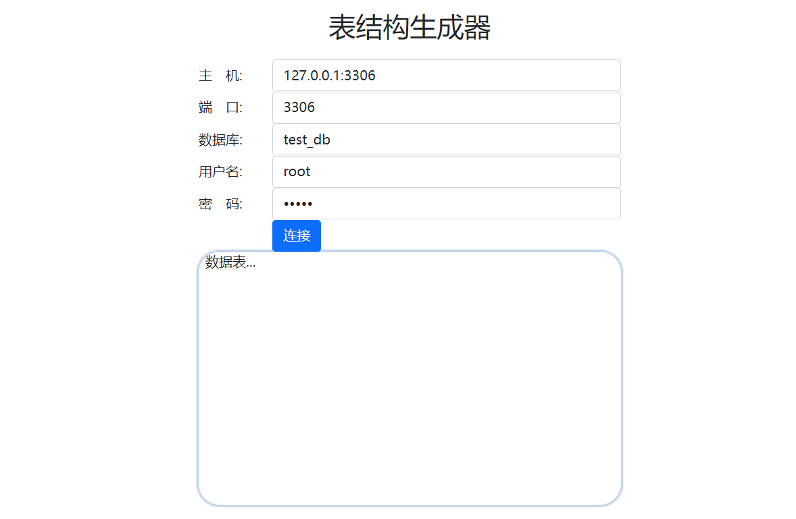
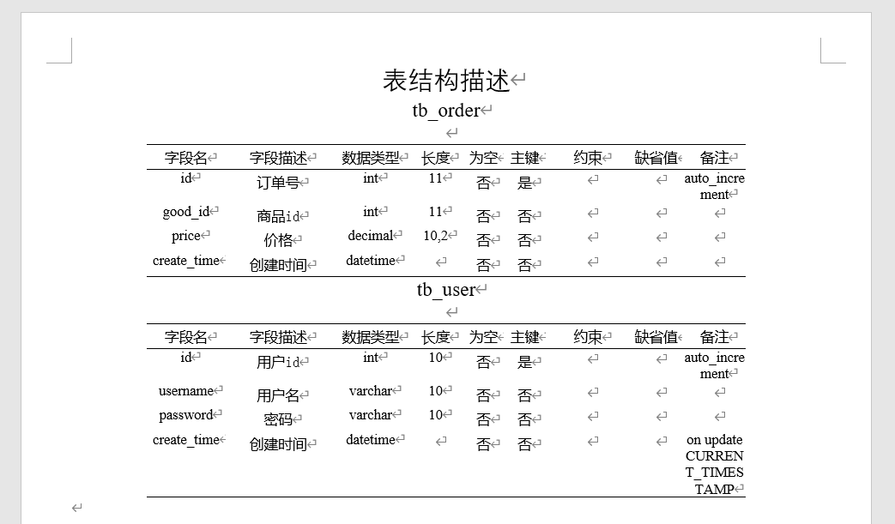

<h1 align="center" style="margin: 30px 0 30px; font-weight: bold;">word-table-generator</h1>
<h4 align="center">将数据库表结构转换为Word文档三线表</h4>

## 项目概述

本项目旨在自动化MySQL数据库中多个表结构的导出过程，并将这些表的结构信息转换为专业的Word文档中的三线表格式。其主要目标是提供一种高效且便捷的方式来文档化数据库表结构，以便用户能够快速浏览和理解这些表的设计细节。

通过此项目，用户可以省去手动创建和更新数据库表结构文档的繁琐过程，从而节省大量时间和精力。生成的Word文档不仅格式统一、清晰易读，还支持灵活的定制选项，以满足不同用户的特定需求。

## 主要功能

1. **自动导出表结构**：项目能够自动连接到MySQL数据库，并导出选定表的结构信息，包括字段名、数据类型、长度、缺省值等。

2. **转换为三线表格式**：导出的表结构信息将被转换为Word文档中的三线表格式，确保文档的专业性和易读性。

3. **支持多表导出**：用户可以选择导出单个或多个表的结构信息，项目将自动处理并合并这些表的数据。

4. **灵活定制**：项目提供了灵活的定制选项，允许用户根据需要调整文档的样式、格式和布局。

5. **高效便捷**：通过自动化过程，项目显著提高了文档创建的效率，为用户节省了大量时间。

## 使用指南

1. **配置数据库连接**：在项目中配置正确的MySQL数据库连接信息，包括主机名、端口、用户名、密码和数据库名称。

2. **选择导出表**：在项目中指定要导出表结构信息的表名，可以选择单个或多个表。

3. **定制文档样式**：根据需要调整文档的样式、格式和布局，以满足特定要求。

4. **执行导出操作**：启动项目并执行导出操作，等待生成包含表结构信息的Word文档。

5. **查看文档**：在指定目录下查看生成的Word文档，快速了解数据库表的结构设计。

## 注意事项

1. 请确认MySQL服务器正在运行，并且可以从执行代码的机器上访问。

2. 请修改配置，确保其与你的数据库设置相匹配。

3. 若MySQL用户权限不足或连接信息错误，代码将无法正常工作。请确保提供正确的用户名、密码、数据库名称和连接信息。

4. 代码提供了一个基本框架，但可能需要根据你的需求定制Word文档的样式和格式。

5. 由于字段名、数据类型等要求使用`Times New Roman`字体，代码中已分列实现英文字体和宋体的分别显示。默认使用`10.5f`字号，相当于五号字体。

## 示例

通过此项目，用户可以轻松地将MySQL数据库中的表结构信息导出为专业的Word文档，为数据库设计、开发和维护提供有力的支持。
